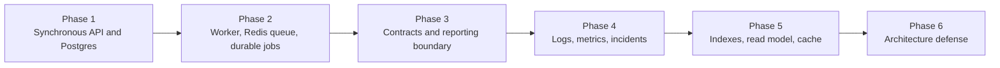

# OpsLedger System Evolution

OpsLedger evolves in response to observed pressure. The system starts small,
adds moving parts only after failure makes them useful, and keeps Postgres as
the clear source of truth unless a later lesson deliberately introduces derived
state.

This is orientation, not an answer key or proof that these components are
always justified.

## Stage 1: One Synchronous Service

OpsLedger begins as one deployable service on a small Linux VPS, deployed with
Dokku and backed by Postgres. It handles customers, work requests, status
events, and lifecycle history directly in request/response flows. Operator
notes remain a deferred domain concept until a prompt creates implementation
pressure.

The teaching goal is ownership of the simplest real system shape: validation,
transactions, migrations, logging, configuration, deploys, and rollback
thinking. Learners should be able to inspect data, explain a write path, and
reason about the consequences of a failed request.

This stage avoids queues, caches, orchestration, and service splits.

## Stage 2: Worker-Backed System

Report generation and notification attempts eventually make synchronous
requests painful. Some work is slow, some work involves side effects, and some
work must be retried without duplicating user-visible outcomes.

OpsLedger then adds background processing in the smallest form that addresses
the observed failure. The learner must understand the original synchronous pain
before applying terms such as retry, idempotency, dead-letter handling, or
backpressure.

Postgres remains the source of truth. Background work must be inspectable,
repairable, and explainable.

## Stage 3: Modular Boundaries Before Extraction

Before any service extraction, OpsLedger is organized into clearer internal
modules: customer identity, workflow state, report rendering, async job state,
notifications, health, and shared infrastructure. The default remains one
deployable service because separate deployment adds real operational cost.
Service boundaries are expensive.

If a later failure justifies extraction, only one boundary is considered
carefully. The first candidate to study is report rendering, because it can be
treated as pure computation over existing source-of-truth data without moving
customer, work request, report job, or notification ownership. Extraction is
not assumed. The learner must compare the cost of a split with the cost of
improving the modular monolith.

The point is to practice boundary reasoning, not to accumulate services.

## Stage 4: Observable Operation

OpsLedger becomes a system the learner can operate under pressure. Logs,
metrics, alerts, runbooks, incident reviews, and rollback decisions are tied to
real failures in requests, workers, reports, notifications, and deploys.

This stage prepares learners to debug with evidence instead of guessing.

## Stage 5: Measured Performance And Derived State

Performance work arrives from evidence. Slow dashboards, expensive report
queries, or high-read work request views may justify indexes, pagination
changes, derived read models, caching, Redis, or other read optimizations.
Each derived view must identify the source of truth, rebuild strategy,
staleness risk, and correction path.

The current system has one Postgres-backed customer dashboard read model and
one Redis cache around that dashboard endpoint. Postgres remains the source of
truth.

## Stage 6: Architecture Defense

After the learner has built, operated, measured, and broken the system, Phase 6
turns those experiences into architecture decision records and decision memo
defense. Proposals must name workload, team, operational cost, source-of-truth
ownership, failure modes, rollback, and evidence that would change the
decision.

The goal is interview-ready judgment grounded in this repository, not bigger
diagrams or architecture labels.
